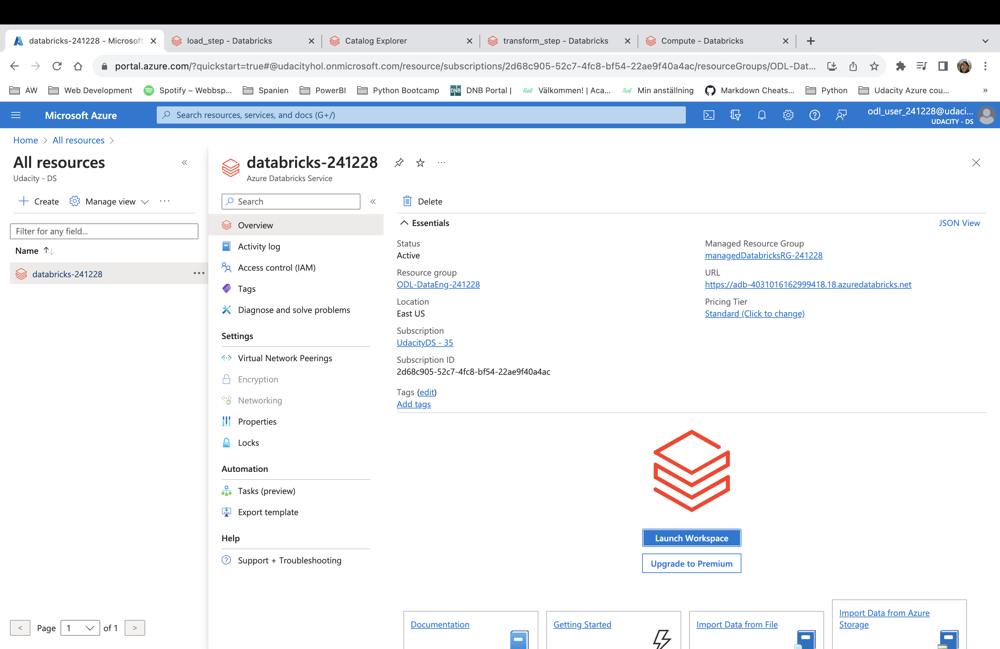
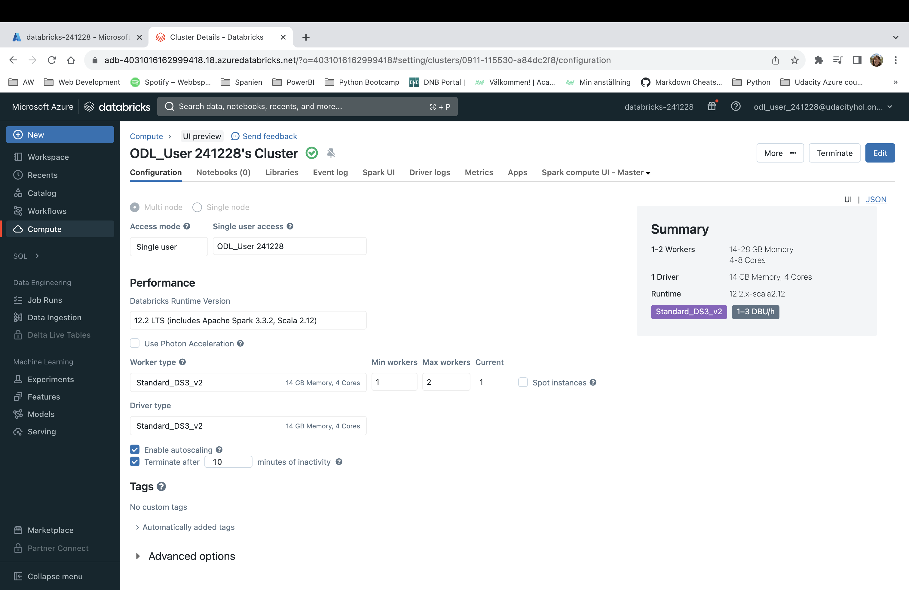
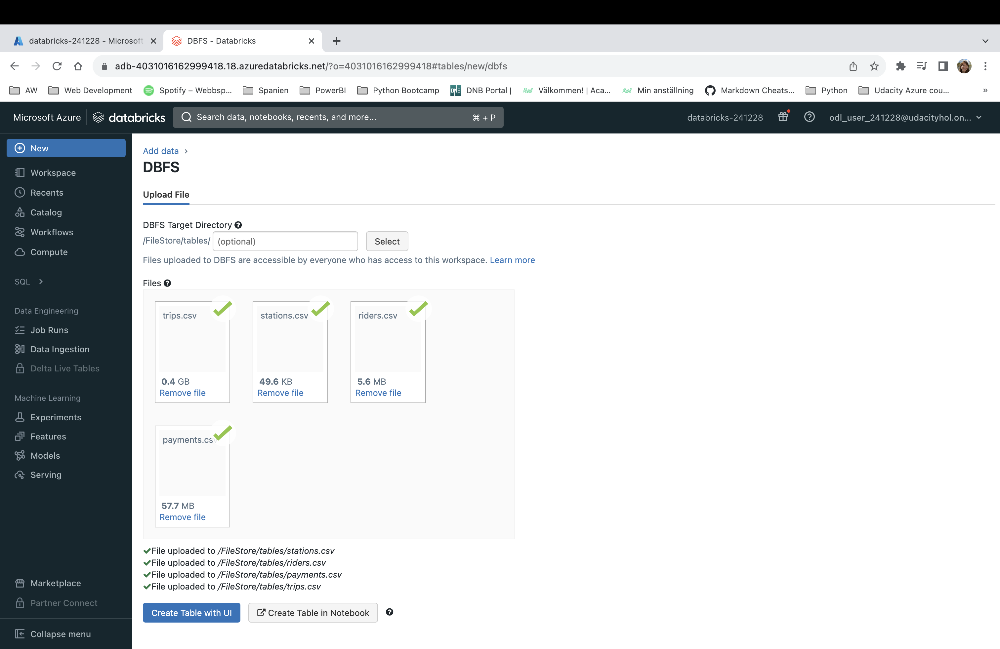
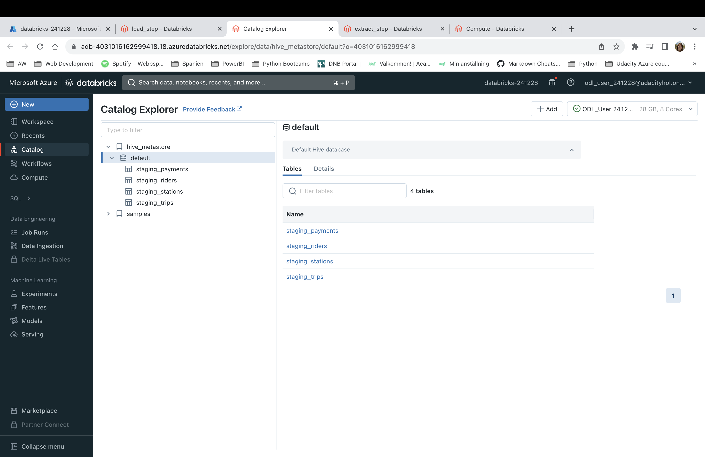
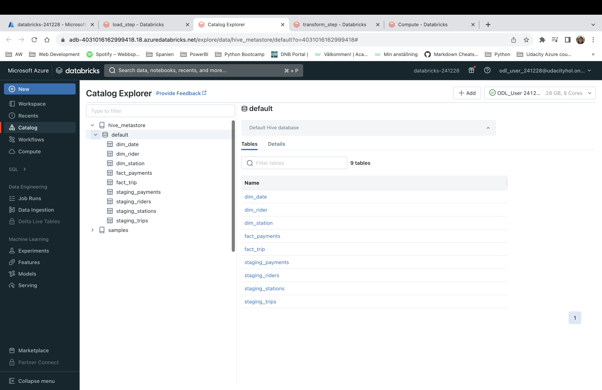

# Building an Azure Data Lake for Bike Share Data Analytics

In this project, I was building data lake solution for Divvy bike share.

## Project Overview

Divvy is a bike sharing program in Chicago, Illinois USA that allows riders to purchase a pass at a kiosk or use a mobile application to unlock a bike at stations around the city and use the bike for a specified amount of time. The bikes can be returned to the same station or to another station. The City of Chicago makes the anonymized bike trip data publicly available for projects like this where we can analyze the data.

Since the data from Divvy are anonymous, we have generated fake rider and account profiles along with fake payment data to go along with the data from Divvy. The dataset looks like this:

### The goal of this project is to develop a data lake solution using Azure Databricks using a lake house architecture. 

You will:

- Design a star schema based on the business outcomes listed below;
- Import the data into Azure Databricks using Delta Lake to create a Bronze data store;
- Create a gold data store in Delta Lake tables;
Transform the data into the star schema for a Gold data store;

You'll implement these requirements by creating a Python notebook, or notebooks in the Azure Databricks workspace.

## TASK NEED TO COMPLETE

### Task 1: Design Bikeshare Star Schema

### Task 2: Import the data into Azure Databricks using Delta Lake to create a Bronze data store

1. Create Azure Databricks Workspace

2. Create Databricks Cluster

3. Import data to DBFS

4. Create a gold data store in Delta Lake tables by using Databricks Python notebook

5. Transform Delta source tables into designed star schema

